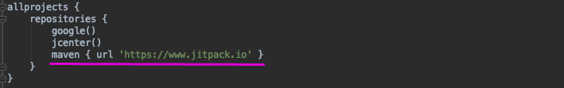

# 대한민국 주소 검색 Library - Android
## 소개

- 웹뷰(WebView)가 아닌 네이티브(Native)를 사용해서 주소 검색을 할 수 있는 Library입니다. 
- 모바일 플랫폼 iOS와 Android를 각각 네이티브로 지원합니다.
- iOS 깃헙 URL: https://github.com/TLCompany/AddressSearch-iOS 
- 주소 검색은 '한국지역 정보 개발원'에서 제공하는 API를 사용하였습니다. (https://www.juso.go.kr/addrlink/getDevEventBoardMainList.do)
- 이 Library는 TLSolution에서 제작하였습니다. (http://www.tlsolution.co.kr)
- 아래의 스크린샷을 참고해 주세요.

## 설치 방법
1. https://www.jitpack.io/ 에 접속 후 AddressSearch-Android의 깃 주소를 검색하면, 버전 별로 설치할 수 dependency를 확인 하실 수 있습니다.
2. 검색 후 가장 최신 버전의 dependency를 복사해서 build.gradle(Module: app)에 붙여 넣어줍니다.

3. Dependency에 들어간 호환 가능한 Java 버전을 compileOptions에 설정해 줍니다. 그리고 애플리케이션의 최소 SDK 버전(minSdkVersion)을 22 이상으로 설정해 줍니다.

4. 마지막으로 build.gradle(Project: 프로젝트이름)에서 
   allprojects안에 repositories에 maven { url 'https://www.jitpack.io' } 을 추가해 줍니다.

## 사용 방법 
1. 사용할 Activity에 AddressSearchHelper의 객체를 아래의 첨부된 이미지를 참고하시면서 생성해 주세요.
2. confmKey를 https://www.juso.go.kr/addrlink/getDevEventBoardMainList.do에서 발급받아 주세요.(무료) 
3. startSearchAddress() 함수를 사용해서 주소 검색을 실행합니다.

4. 검색이 완료와 사용자가 상세주소 입력이 완료 된 Address 데이터 모델을 onActivityResult()에서 받습니다.(아래 첨부 이미지 참고)

## 데이터 모델
- Address 모델의 데이터

## 개발회사 소개 
- 우리는 스타트업의 성장을 위한 모바일 통합 개발 솔루션을 통해 성공적인 비즈니스를 만들어갑니다.
- TLSolution 홈페이지: http://www.tlsolution.co.kr/
